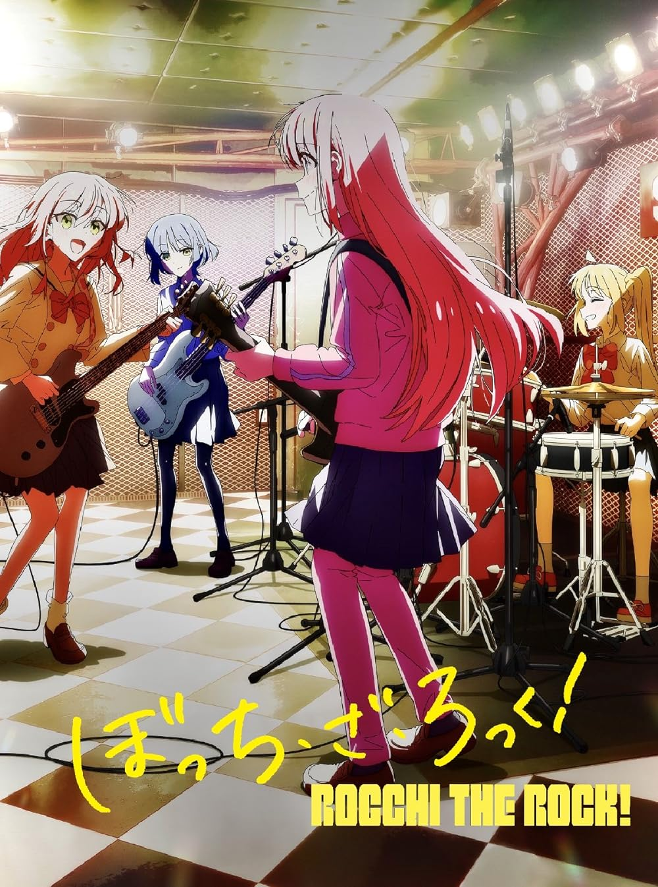
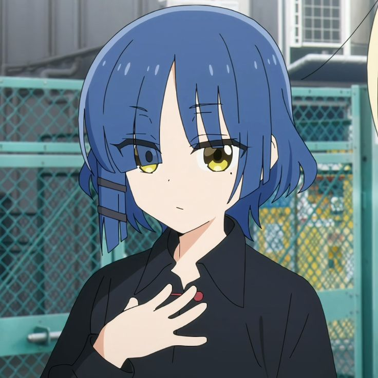
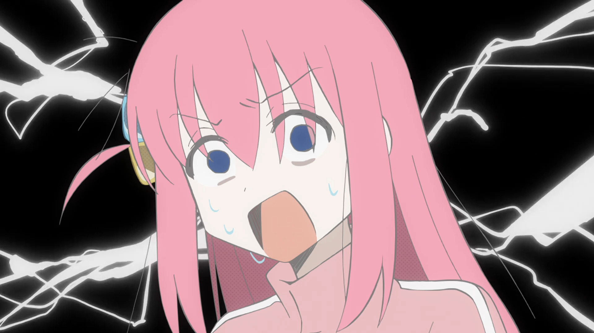
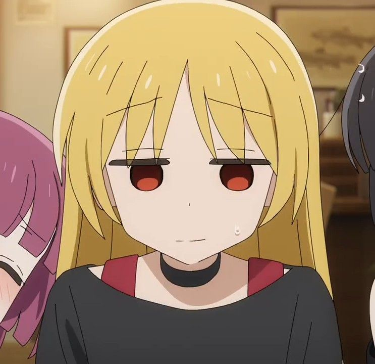
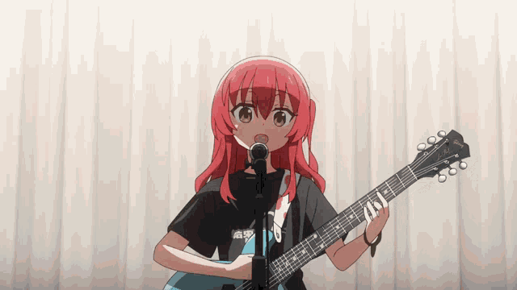

# BOCCHI THE ROCK!

## PART I – IN WHICH THE SERIES OF BOCCHI THE ROCK WAS INTRODUCED ##

To know about Bocchi the Rock is to be one of the enlightened. It is to bask in the glorious magnificence of the Ayatollah of Rock 'n' Rolla. When one must look for a figure to spend their lives worshipping, it would have to be this.

## PART II – WHERE THE HISTORY OF THE SERIES WAS LAID UPON ## 

Bocchi the Rock is a manga series which has recently gotten an anime adaptation which has `rock` the world. It aired back in 2022, and still has a large following up to this day. Most notably, it had released 2 recap movies, a musical play, multiple albums and live concerts.

Even in the Philippines it has garnered a `rockillion` amount of followers. With it spouting multiple amounts of memes such as Kita being a Filipino. There was also a spike of anime merchandise and cosplays shortly after that. You could not go to a single anime convention event without spotting atleast three Bocchi the Rock cosplays. 

## PART III – WHEREIN THE NARRATIVE OF BOCCHI THE ROCK IS DISCUSSED ## 

> *Abandoning your uniqueness is equivalent to dying.*
>
> Ryo Yamada

The series follows a young girl, a legend in the making, Hitori Gotoh. Where she goes through her everyday life as a student stumbling to find a way to achieve her dream. Eventually, overcoming her social anxiety she triumphed and `rocked` over her obstacles, as she becomes Bocchi the Rock!

The core of the story is about self-improvement. To be better than which you were yesterday. To take up challenges and push yourself beyond your boundaries so that you can be the person you wish to be. Of course, Hitori would not be able to do any of those by herself. As is shown by in Episode 1 - 7:37, where Nijika had to drag Hitori to her first gig. Eventually though, Hitori grew as a character throughout the series. To the point where she was the one that was dragging her band to perform in a contest, a Battle of the Bands if you will.

## PART IV – OF THE LEGEND, BOCCHI THE ROCK ## 

There are many coming of age stories, but I believe the one that makes this stand out the most is in its relatability. The main character spoke to many hearts which prompted inspiration for many people. That if she can do it, I would be able to as well. This sense of being Bocchi the Rock is what made many like her as a character.
Of course, the series would not be complete without the comedy. In this regard, the anime has surpassed the manga as it has adapted jokes and transformed it into a visual style which is unique to the anime itself. 

## PART V – OF THE MUSIC CONTRIVED BY THE KESSOKU BAND ## 

As the series’ name suggests. It is about music. A `rock` and a band by the name of Kessoku Band in which Hitori Gotoh is a part of. This band has the members:
- Nijika Ijichi
- Kita Ikuyo
- Ryo Yamada
- Hitori Gotoh
  
The anime goes into this further with creating albums which was featured in the anime and the movies.These songs do have meaning to them, as it was written by Hitori Gotoh herself. Because of this, their lyrics do have a melancholy theme to them, however with the cheeriness of Kita Ikuyo’s vocals, this negates and harmonizes those two things which makes them great. The lyrics and music are both catchy. Which I myself listened to probably hundreds of times already. 

## PART VI – OF THE BAND IN WHICH IS RELATED TO THE PREVIOUS BAND, SICK HACK AND OTHER VARIOUS ROLE MODELS ## 

Throughout the series we are introduced to various characters that guides the young heroines. The first of which is Seika Ijichi. She is the owner of the bar where the band performs and is a sister of Nijika. She was the first one that gave Hitori a job which helped her in improving herself. Her business partner is PA-san. Which controls the sound system of the bar. Together they helped the band in reaching new heights by allowing them to perform gigs.

The next one we meet is Hiroi Kikuri. This character serves as the mentor to Hitori. While Hitori has been peer-pressured to go beyond her boundaries. It is Hiroi who taught her to do so by herself. To push her limits and to stand on her own feet, without needing others.
These characters are essential to the story as they show what the band may achieve. Success, as shown by Hiroi’s band Sick Hack. A dream, as shown by Seika’s bar and her hopes with it.

## PART VII – WHEREIN THE CONCLUSION IS DRAWN ## 

Bocchi the Rock while it may just be a funny comedic anime on the surface. Is an inspiration to many. It helped them see that whatever dream they might have, it won’t happen if they wont adapt to it. They must push themselves to be the type of person that might someday, achieve what they want in life.

**KEEP BOCCHI THE ROCKING ON!**
🪨🩷

## PART VIII - OF WHICH THE HOPES FOR THE FUTURE IS STATED ##

It is my hopes that in the future, ODEX or any other organization will once again host fan screening along with different merchs for the Recap Movies of Bocchi the Rock! The last one was pretty good. A new season should be announced soon I hope, but the director currently is working on other anime so it is blurry to say the least.

For future updates please visit [their website](https://bocchi.rocks/).
---
